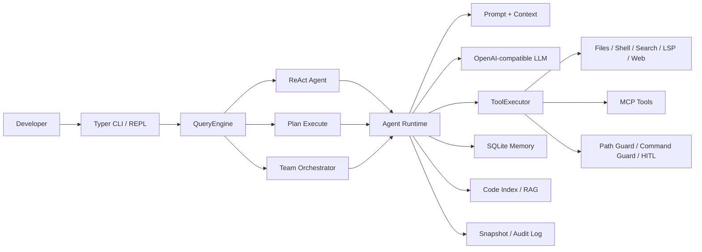

<div align="center">


# Ewancli Python

<p><strong>English</strong> · <a href="README.zh-CN.md">简体中文</a> · <a href="README.zh-Hant.md">繁體中文</a></p>

### A terminal AI agent that understands repositories, calls tools, and completes development tasks

[](https://www.python.org/)
[](#three-execution-modes)
[](#mcp-and-extension)
[](LICENSE)

This is more than a chat wrapper for the command line. Ewancli Python combines models, code tools, execution strategies, permission boundaries, memory, and recovery mechanisms into a working agent runtime.

[Live Run](#live-run) · [Architecture](#architecture) · [Quick Start](#quick-start) · [Engineering Highlights](#engineering-highlights)

</div>

> The repository is named **Ewancli Python**. The current Python distribution and command names are `ewancli-python` and `ewancli`.

## Live Run

### Interactive workspace

Running `ewancli` opens the default Rich interface. Its home screen brings together authentication, MCP and skill status, tool count, model selection, context usage, workspace, and permission mode. The input supports slash commands and `@path` file references.


```bash
ewancli
```

### A real agent task

The session below is a real model call against this repository on Windows. The agent used file and code-search tools, traced the CLI, core loop, and tool-registration path, then returned a source-grounded architecture summary. No API key is present in the screenshot.


```bash
ewancli --plain -p "Read-only analysis: summarize the architecture of this repository"
```

## In 30 Seconds

| Question | Ewancli Python's answer |
| --- | --- |
| What can it do? | Read and search code, apply patches, run commands, call MCP tools, plan tasks, and coordinate sub-agents |
| How does it move beyond suggestions? | A ReAct loop repeats `model decision -> tool call -> observation -> next decision` |
| How are complex tasks handled? | Plan mode tracks explicit steps and state; Team mode divides work by role and synthesizes results |
| How is risk controlled? | Workspace path guards, dangerous-command checks, HITL approval, JSONL audit, and change snapshots |
| How is it extended? | Built-in tool registry, MCP client/server, skills, and an HTTP runtime API |
| How is context controlled? | Automatic compaction, SQLite long-term memory, project configuration, and a local code index |

## Architecture



A tool call never goes straight from model output to the operating system. `ToolExecutor` validates arguments and evaluates policy first, then executes and audits the operation before returning a structured result. ReAct, Plan, and Team modes therefore share the same safety semantics.

## Three Execution Modes

| Mode | Best for | Control flow |
| --- | --- | --- |
| `react` | Bug diagnosis, small edits, exploratory work | Observes and acts incrementally, adapting after each tool result |
| `plan` | Cross-file changes, migrations, long workflows | Creates a plan, executes each step, and updates explicit state |
| `team` | Complex work that can be divided | Planner, Worker, and Reviewer roles collaborate |

```bash
ewancli -p "Find the root cause of the authentication failure" --mode react
ewancli -p "Refactor configuration and add regression tests" --mode plan
ewancli -p "Review the backend, frontend, and tests in parallel" --mode team --worker-mode react
```

## Engineering Highlights

### The agent is not one giant function

- `entrypoints/cli.py` owns commands, configuration, and mode selection.
- `agent/agent.py` manages sessions, context, events, and mode dispatch.
- `agent/plan_execute.py` and `agent/orchestrator.py` implement planned execution and multi-agent coordination.
- `tools/registry.py` and `tools/executor.py` separate tool discovery from execution.

### Safety and recovery are runtime capabilities

- `PathGuard` confines file operations to the workspace.
- `CommandGuard` recognizes high-risk commands.
- HITL modes request human approval before sensitive operations.
- Snapshots preserve state around changes and support failed-operation recovery.
- The audit log records tool calls and policy decisions for investigation.

### Context does not grow without bounds

For long sessions, Context Manager compacts early messages. Cross-session facts move into SQLite memory, while repository facts and code indices remain isolated by project so unrelated workspaces cannot pollute one another.

## MCP and Extension

Ewancli Python can consume external MCP servers and expose its built-in tools as an MCP server.

```json
{
  "mcpServers": {
    "example": {
      "type": "stdio",
      "command": "npx",
      "args": ["-y", "example-mcp-server"]
    }
  }
}
```

```bash
ewancli mcp list
ewancli mcp init-chrome
ewancli mcp serve --transport stdio
```

User-level `~/.ewancli/mcp.json` and project-level `.ewancli/mcp.json` are merged into the effective MCP configuration.

## Quick Start

### 1. Install

```bash
git clone https://github.com/xuytwinter/Ewancli-python.git
cd Ewancli-python

uv sync --extra dev
uv run ewancli doctor
```

Without `uv`, use a standard virtual environment:

```bash
python -m venv .venv
# Windows: .venv\Scripts\activate
# macOS / Linux: source .venv/bin/activate
pip install -e .
```

### 2. Configure a model

Create `.env` in the repository root:

```dotenv
EWANCLI_PROVIDER=deepseek
EWANCLI_MODEL=deepseek-chat
EWANCLI_API_KEY=your-api-key
# Optional: custom OpenAI-compatible service
# EWANCLI_BASE_URL=https://example.com/v1
```

### 3. Use it

```bash
# Interactive mode
uv run ewancli

# One-shot task
uv run ewancli --plain -p "Analyze this project's architecture and identify weak test coverage"
```

## Configuration Precedence

Values are merged in this order, with later sources taking precedence:

```text
built-in defaults < user config < project config < .env < process environment < CLI arguments
```

| Variable | Purpose |
| --- | --- |
| `EWANCLI_API_KEY` | Shared model credential |
| `EWANCLI_PROVIDER` / `EWANCLI_MODEL` | Provider and model ID |
| `EWANCLI_BASE_URL` | Custom OpenAI-compatible endpoint |
| `EWANCLI_RENDER_MODE` | `inline` or `plain` |
| `EWANCLI_HITL` | `always`, `auto`, or `never` |
| `EWANCLI_MCP` / `EWANCLI_SKILL` / `EWANCLI_MEMORY` | Feature flags |

## Runtime API

An HTTP runtime is available for embedding Ewancli in automation:

```bash
export EWANCLI_RUNTIME_API_KEY=replace-with-a-strong-secret
uv run ewancli serve --port 8080
```

The runtime API key is separate from model credentials and protects thread and background-task endpoints.

## Project Layout

```text
src/ewancli/
|-- agent/       # ReAct, Plan-and-Execute, Team Orchestrator
|-- tools/       # Tool registry, executor, and built-ins
|-- policy/      # Path, command, and audit policies
|-- mcp/         # MCP client and server
|-- memory/      # SQLite long-term memory
|-- rag/         # Local code index and retrieval
|-- snapshot/    # Change snapshots and recovery
|-- runtime/     # HTTP API and durable background tasks
`-- entrypoints/ # Typer CLI and interactive REPL
```

## Development and Verification

```bash
uv run pytest
uv run ruff check .
uv run ruff format --check .
```

Automated tests cover configuration, LLM integration, tool policy, MCP, memory, snapshots, the runtime API, and multi-agent orchestration. On Windows, POSIX `0600` permission assertions and fake-client key validation have platform/fixture differences documented in test output; these do not affect real CLI model calls.

## Interview Talking Points

1. Why the agent loop, tool registry, and tool executor are separate boundaries.
2. How Plan and ReAct share a tool layer while keeping different control flows.
3. Why model-generated arguments must pass path, command, and approval policy.
4. Which distinct problems context compaction, long-term memory, and code RAG solve.
5. How the runtime API turns a CLI session into a cancellable, queryable background task.

## Security

The agent can modify files and execute commands. Keep workspace path protection and the default HITL policy enabled. Never commit `.env`, API keys, runtime keys, MCP credentials, or local memory databases.

## License

[MIT](LICENSE)
