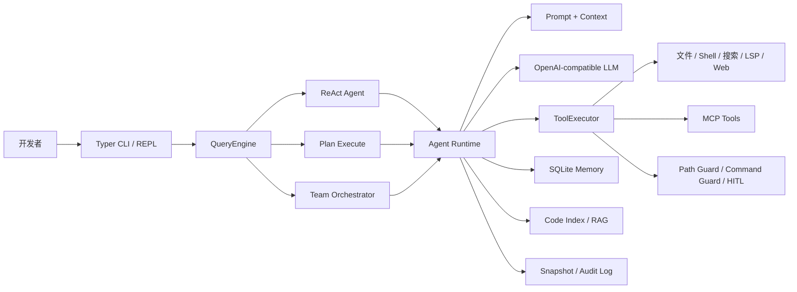

<div align="center">


# Ewancli Python

<p><a href="README.md">English</a> · <strong>简体中文</strong> · <a href="README.zh-Hant.md">繁體中文</a></p>

### 一个能理解代码仓库、调用工具并完成开发任务的终端 AI Agent

[](https://www.python.org/)
[](#三种执行模式)
[](#mcp-与扩展)
[](LICENSE)

不是一个只会聊天的命令行壳。Ewancli Python 把模型、代码工具、执行策略、权限边界、记忆与可恢复机制组合成了一套可运行的 Agent Runtime。

[真实运行](#真实运行) · [系统架构](#系统架构) · [快速开始](#快速开始) · [工程亮点](#工程亮点)

</div>

> 仓库名为 **Ewancli Python**，当前 Python 包名与命令名为 `ewancli-python` / `ewancli`。

## 真实运行

### 交互式工作台

直接运行 `ewancli` 会进入默认的 Rich 交互模式。启动页集中展示登录状态、MCP、Skill、工具数量、模型、上下文占用、当前工作区与权限模式；输入框支持 Slash Command 和 `@path` 文件引用。


```bash
ewancli
```

### Agent 真实执行

下面的画面来自本仓库在 Windows 上的一次真实模型调用：Agent 调用文件与代码检索工具，定位 CLI、核心循环与工具注册链，最后给出基于源码的架构总结。截图未包含 API Key。


```bash
ewancli --plain -p "只读分析当前项目并总结架构"
```

## 30 秒看懂

| 你关心的问题 | Ewancli Python 的回答 |
| --- | --- |
| 它能做什么？ | 读取与检索代码、应用补丁、执行命令、调用 MCP、规划任务并组织多个子 Agent |
| 如何避免只说不做？ | ReAct 循环持续执行 `模型决策 → 工具调用 → 结果回填 → 下一步决策` |
| 复杂任务如何处理？ | Plan 模式显式维护步骤与状态；Team 模式按角色拆分后汇总结果 |
| 如何控制风险？ | 路径围栏、危险命令拦截、HITL 审批、JSONL 审计与变更快照 |
| 如何扩展？ | 内置 Tool Registry、MCP Client/Server、Skill、Runtime HTTP API |
| 如何控制上下文？ | 自动压缩、SQLite 长期记忆、项目配置与本地代码索引 |

## 系统架构



一次工具调用不会直接“裸奔”到操作系统：`ToolExecutor` 先做参数校验与策略检查，再执行、审计并把结构化结果返回 Agent。这个边界让上层的 ReAct、Plan 和 Team 可以共享同一套安全语义。

## 三种执行模式

| 模式 | 适合场景 | 执行方式 |
| --- | --- | --- |
| `react` | 定位 Bug、小步修改、探索性任务 | 边观察边行动，依据每次工具结果调整下一步 |
| `plan` | 跨文件需求、迁移、长链路任务 | 先生成计划，再逐项执行并更新状态 |
| `team` | 可并行拆分的复杂任务 | Planner / Worker / Reviewer 分工协作 |

```bash
ewancli -p "分析认证失败的根因" --mode react
ewancli -p "重构配置模块并补齐测试" --mode plan
ewancli -p "并行检查后端、前端和测试" --mode team --worker-mode react
```

## 工程亮点

### Agent 不是一个大函数

- `entrypoints/cli.py` 只负责命令、配置与运行模式分流。
- `agent/agent.py` 管理会话、上下文、事件与模式调度。
- `agent/plan_execute.py` 和 `agent/orchestrator.py` 分别承载计划执行与多 Agent 协作。
- `tools/registry.py`、`tools/executor.py` 将工具发现和工具执行解耦。

### 安全与恢复是运行时能力

- `PathGuard` 将文件操作限制在工作区内。
- `CommandGuard` 识别高风险命令。
- HITL 模式可在敏感操作前请求人工确认。
- Snapshot 在变更前后保存状态，可用于回退失败操作。
- Audit Log 记录工具调用与策略结论，便于追踪问题。

### 上下文不会无限增长

会话较长时，Context Manager 对早期消息进行压缩；需要跨会话保留的信息进入 SQLite Memory；仓库级事实与代码索引按当前项目隔离，避免不同项目之间相互污染。

## MCP 与扩展

Ewancli Python 既能消费 MCP Server，也能把内置工具暴露为 MCP Server。

```json
{
  "mcpServers": {
    "example": {
      "type": "stdio",
      "command": "npx",
      "args": ["-y", "example-mcp-server"]
    }
  }
}
```

```bash
ewancli mcp list
ewancli mcp init-chrome
ewancli mcp serve --transport stdio
```

MCP 配置由用户级 `~/.ewancli/mcp.json` 与项目级 `.ewancli/mcp.json` 合并。

## 快速开始

### 1. 安装

```bash
git clone https://github.com/xuytwinter/Ewancli-python.git
cd Ewancli-python

uv sync --extra dev
uv run ewancli doctor
```

没有 `uv` 时也可以使用标准虚拟环境：

```bash
python -m venv .venv
# Windows: .venv\Scripts\activate
# macOS / Linux: source .venv/bin/activate
pip install -e .
```

### 2. 配置模型

在仓库根目录创建 `.env`：

```dotenv
EWANCLI_PROVIDER=deepseek
EWANCLI_MODEL=deepseek-chat
EWANCLI_API_KEY=your-api-key
# 可选：自定义 OpenAI-compatible 服务
# EWANCLI_BASE_URL=https://example.com/v1
```

### 3. 开始使用

```bash
# 交互模式
uv run ewancli

# 一次性任务
uv run ewancli --plain -p "分析这个项目的架构，并指出测试覆盖薄弱的模块"
```

## 配置优先级

配置按以下顺序合并，后者覆盖前者：

```text
内置默认值 < 用户配置 < 项目配置 < .env < 进程环境变量 < CLI 参数
```

| 变量 | 用途 |
| --- | --- |
| `EWANCLI_API_KEY` | 通用模型密钥 |
| `EWANCLI_PROVIDER` / `EWANCLI_MODEL` | Provider 与模型 ID |
| `EWANCLI_BASE_URL` | 自定义 OpenAI-compatible 地址 |
| `EWANCLI_RENDER_MODE` | `inline` 或 `plain` |
| `EWANCLI_HITL` | `always`、`auto` 或 `never` |
| `EWANCLI_MCP` / `EWANCLI_SKILL` / `EWANCLI_MEMORY` | 功能开关 |

## Runtime API

CLI 之外还提供可嵌入自动化流程的 HTTP Runtime：

```bash
export EWANCLI_RUNTIME_API_KEY=replace-with-a-strong-secret
uv run ewancli serve --port 8080
```

Runtime API Key 与模型 Key 完全分离，用于保护线程和后台任务接口。

## 项目结构

```text
src/ewancli/
├── agent/       # ReAct、Plan-and-Execute、Team Orchestrator
├── tools/       # Tool Registry、Executor 与内置工具
├── policy/      # 路径、命令与审计策略
├── mcp/         # MCP Client / Server
├── memory/      # SQLite 长期记忆
├── rag/         # 本地代码索引与检索
├── snapshot/    # 变更快照与恢复
├── runtime/     # HTTP API 与持久化后台任务
└── entrypoints/ # Typer CLI 与交互式 REPL
```

## 开发与验证

```bash
uv run pytest
uv run ruff check .
uv run ruff format --check .
```

仓库当前包含针对配置、LLM、工具策略、MCP、记忆、快照、Runtime API 与多 Agent 编排的自动化测试。Windows 上执行测试时，POSIX `0600` 权限断言与 Fake Client 的密钥校验存在平台/测试夹具差异，详见测试输出；这不影响 CLI 的真实模型运行。

## 面试时可以聊什么

1. 为什么把 Agent loop、Tool Registry 与 Tool Executor 分成三个边界。
2. Plan 和 ReAct 如何共享工具层，又如何保持不同的控制流。
3. LLM 生成的参数为什么必须经过路径、命令与审批策略。
4. 长上下文压缩、长期记忆与代码 RAG 分别解决什么问题。
5. Runtime API 如何把一次 CLI 会话扩展成可取消、可查询的后台任务。

## 安全提示

Agent 具备修改文件和执行命令的能力。请保留工作区路径保护与默认 HITL 策略，不要提交 `.env`、API Key、Runtime Key、MCP 凭据或本地记忆数据库。

## License

[MIT](LICENSE)
