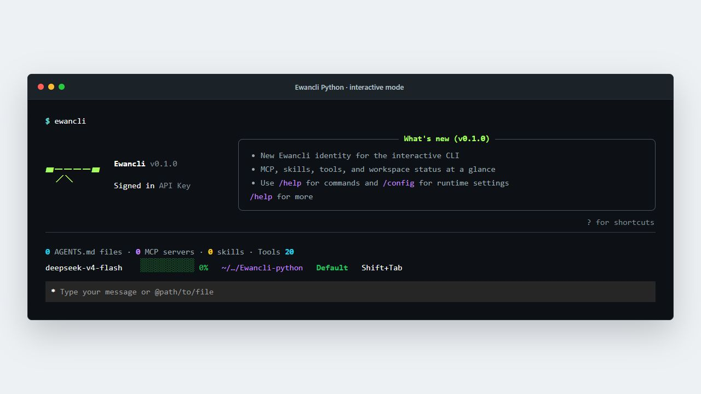
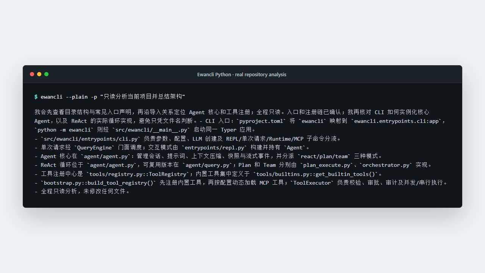
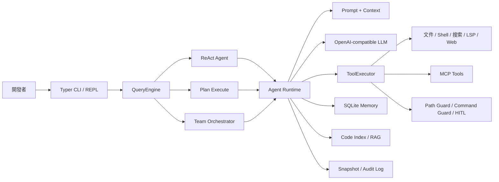

<div align="center">


# Ewancli Python

<p><a href="README.md">English</a> · <a href="README.zh-CN.md">简体中文</a> · <strong>繁體中文</strong></p>

### 一個能理解代碼倉庫、調用工具並完成開發任務的終端 AI Agent

[](https://www.python.org/)
[](#三種執行模式)
[](#mcp-與擴展)
[](LICENSE)

不是一個只會聊天的命令行殼。Ewancli Python 把模型、代碼工具、執行策略、權限邊界、記憶與可恢復機制組合成了一套可運行的 Agent Runtime。

[真實運行](#真實運行) · [系統架構](#系統架構) · [快速開始](#快速開始) · [工程亮點](#工程亮點)

</div>

> 倉庫名爲 **Ewancli Python**，當前 Python 包名與命令名爲 `ewancli-python` / `ewancli`。

## 真實運行

### 交互式工作臺

直接運行 `ewancli` 會進入默認的 Rich 交互模式。啓動頁集中展示登錄狀態、MCP、Skill、工具數量、模型、上下文佔用、當前工作區與權限模式；輸入框支持 Slash Command 和 `@path` 文件引用。



```bash
ewancli
```

### Agent 真實執行

下面的畫面來自本倉庫在 Windows 上的一次真實模型調用：Agent 調用文件與代碼檢索工具，定位 CLI、核心循環與工具註冊鏈，最後給出基於源碼的架構總結。截圖未包含 API Key。



```bash
ewancli --plain -p "只讀分析當前項目並總結架構"
```

## 30 秒看懂

| 你關心的問題 | Ewancli Python 的回答 |
| --- | --- |
| 它能做什麼？ | 讀取與檢索代碼、應用補丁、執行命令、調用 MCP、規劃任務並組織多個子 Agent |
| 如何避免只說不做？ | ReAct 循環持續執行 `模型決策 → 工具調用 → 結果回填 → 下一步決策` |
| 複雜任務如何處理？ | Plan 模式顯式維護步驟與狀態；Team 模式按角色拆分後彙總結果 |
| 如何控制風險？ | 路徑圍欄、危險命令攔截、HITL 審批、JSONL 審計與變更快照 |
| 如何擴展？ | 內置 Tool Registry、MCP Client/Server、Skill、Runtime HTTP API |
| 如何控制上下文？ | 自動壓縮、SQLite 長期記憶、項目配置與本地代碼索引 |

## 系統架構



一次工具調用不會直接“裸奔”到操作系統：`ToolExecutor` 先做參數校驗與策略檢查，再執行、審計並把結構化結果返回 Agent。這個邊界讓上層的 ReAct、Plan 和 Team 可以共享同一套安全語義。

## 三種執行模式

| 模式 | 適合場景 | 執行方式 |
| --- | --- | --- |
| `react` | 定位 Bug、小步修改、探索性任務 | 邊觀察邊行動，依據每次工具結果調整下一步 |
| `plan` | 跨文件需求、遷移、長鏈路任務 | 先生成計劃，再逐項執行並更新狀態 |
| `team` | 可並行拆分的複雜任務 | Planner / Worker / Reviewer 分工協作 |

```bash
ewancli -p "分析認證失敗的根因" --mode react
ewancli -p "重構配置模塊並補齊測試" --mode plan
ewancli -p "並行檢查後端、前端和測試" --mode team --worker-mode react
```

## 工程亮點

### Agent 不是一個大函數

- `entrypoints/cli.py` 只負責命令、配置與運行模式分流。
- `agent/agent.py` 管理會話、上下文、事件與模式調度。
- `agent/plan_execute.py` 和 `agent/orchestrator.py` 分別承載計劃執行與多 Agent 協作。
- `tools/registry.py`、`tools/executor.py` 將工具發現和工具執行解耦。

### 安全與恢復是運行時能力

- `PathGuard` 將文件操作限制在工作區內。
- `CommandGuard` 識別高風險命令。
- HITL 模式可在敏感操作前請求人工確認。
- Snapshot 在變更前後保存狀態，可用於回退失敗操作。
- Audit Log 記錄工具調用與策略結論，便於追蹤問題。

### 上下文不會無限增長

會話較長時，Context Manager 對早期消息進行壓縮；需要跨會話保留的信息進入 SQLite Memory；倉庫級事實與代碼索引按當前項目隔離，避免不同項目之間相互污染。

## MCP 與擴展

Ewancli Python 既能消費 MCP Server，也能把內置工具暴露爲 MCP Server。

```json
{
  "mcpServers": {
    "example": {
      "type": "stdio",
      "command": "npx",
      "args": ["-y", "example-mcp-server"]
    }
  }
}
```

```bash
ewancli mcp list
ewancli mcp init-chrome
ewancli mcp serve --transport stdio
```

MCP 配置由用戶級 `~/.ewancli/mcp.json` 與項目級 `.ewancli/mcp.json` 合併。

## 快速開始

### 1. 安裝

```bash
git clone https://github.com/xuytwinter/Ewancli-python.git
cd Ewancli-python

uv sync --extra dev
uv run ewancli doctor
```

沒有 `uv` 時也可以使用標準虛擬環境：

```bash
python -m venv .venv
# Windows: .venv\Scripts\activate
# macOS / Linux: source .venv/bin/activate
pip install -e .
```

### 2. 配置模型

在倉庫根目錄創建 `.env`：

```dotenv
EWANCLI_PROVIDER=deepseek
EWANCLI_MODEL=deepseek-chat
EWANCLI_API_KEY=your-api-key
# 可選：自定義 OpenAI-compatible 服務
# EWANCLI_BASE_URL=https://example.com/v1
```

### 3. 開始使用

```bash
# 交互模式
uv run ewancli

# 一次性任務
uv run ewancli --plain -p "分析這個項目的架構，並指出測試覆蓋薄弱的模塊"
```

## 配置優先級

配置按以下順序合併，後者覆蓋前者：

```text
內置默認值 < 用戶配置 < 項目配置 < .env < 進程環境變量 < CLI 參數
```

| 變量 | 用途 |
| --- | --- |
| `EWANCLI_API_KEY` | 通用模型密鑰 |
| `EWANCLI_PROVIDER` / `EWANCLI_MODEL` | Provider 與模型 ID |
| `EWANCLI_BASE_URL` | 自定義 OpenAI-compatible 地址 |
| `EWANCLI_RENDER_MODE` | `inline` 或 `plain` |
| `EWANCLI_HITL` | `always`、`auto` 或 `never` |
| `EWANCLI_MCP` / `EWANCLI_SKILL` / `EWANCLI_MEMORY` | 功能開關 |

## Runtime API

CLI 之外還提供可嵌入自動化流程的 HTTP Runtime：

```bash
export EWANCLI_RUNTIME_API_KEY=replace-with-a-strong-secret
uv run ewancli serve --port 8080
```

Runtime API Key 與模型 Key 完全分離，用於保護線程和後臺任務接口。

## 項目結構

```text
src/ewancli/
├── agent/       # ReAct、Plan-and-Execute、Team Orchestrator
├── tools/       # Tool Registry、Executor 與內置工具
├── policy/      # 路徑、命令與審計策略
├── mcp/         # MCP Client / Server
├── memory/      # SQLite 長期記憶
├── rag/         # 本地代碼索引與檢索
├── snapshot/    # 變更快照與恢復
├── runtime/     # HTTP API 與持久化後臺任務
└── entrypoints/ # Typer CLI 與交互式 REPL
```

## 開發與驗證

```bash
uv run pytest
uv run ruff check .
uv run ruff format --check .
```

倉庫當前包含針對配置、LLM、工具策略、MCP、記憶、快照、Runtime API 與多 Agent 編排的自動化測試。Windows 上執行測試時，POSIX `0600` 權限斷言與 Fake Client 的密鑰校驗存在平臺/測試夾具差異，詳見測試輸出；這不影響 CLI 的真實模型運行。

## 面試時可以聊什麼

1. 爲什麼把 Agent loop、Tool Registry 與 Tool Executor 分成三個邊界。
2. Plan 和 ReAct 如何共享工具層，又如何保持不同的控制流。
3. LLM 生成的參數爲什麼必須經過路徑、命令與審批策略。
4. 長上下文壓縮、長期記憶與代碼 RAG 分別解決什麼問題。
5. Runtime API 如何把一次 CLI 會話擴展成可取消、可查詢的後臺任務。

## 安全提示

Agent 具備修改文件和執行命令的能力。請保留工作區路徑保護與默認 HITL 策略，不要提交 `.env`、API Key、Runtime Key、MCP 憑據或本地記憶數據庫。

## License

[MIT](LICENSE)
